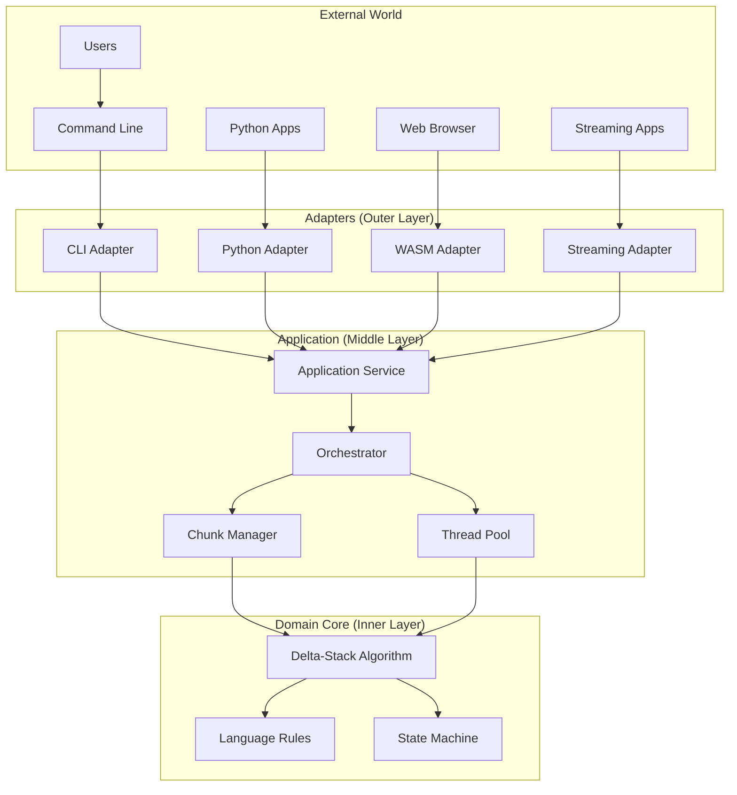

# Architecture Design

## Overview

The Delta-Stack Monoid Sentence Boundary Detection (SBD) library is a high-performance, parallel text processing system designed to identify sentence boundaries in multiple languages. This document describes the architecture, design decisions, and extension points to help contributors understand and work with the codebase effectively.

### Why This Architecture?

We chose a **Hexagonal Architecture (Ports & Adapters)** pattern to achieve:

- **Clear separation of concerns** - Algorithm logic is isolated from I/O and language bindings
- **Easy testing** - Core logic can be tested without external dependencies
- **Multiple interfaces** - Same core supports CLI, Python, WASM, and streaming APIs
- **Future extensibility** - New languages and adapters can be added without modifying the core

## System Architecture



## Core Algorithm

The system is built around the **Delta-Stack Monoid** algorithm for parallel sentence boundary detection. For detailed mathematical foundation and implementation details, see [DELTA_STACK_ALGORITHM.md](DELTA_STACK_ALGORITHM.md).

## Key Design Decisions

### 1. Hexagonal Architecture

**Decision**: Separate domain logic from infrastructure concerns using Ports & Adapters pattern.

**Rationale**: 
- Allows pure functional core that's easy to test
- Enables multiple delivery mechanisms (CLI, Python, WASM) without duplicating logic
- Prepares for `no_std` support for embedded systems

**Trade-off**: More layers can be initially confusing for newcomers.

### 2. Rust for Core Implementation

**Decision**: Implement core algorithm in Rust with safe abstractions.

**Rationale**:
- Memory safety without garbage collection
- Zero-cost abstractions for performance
- Excellent FFI for Python/WASM bindings
- Strong ecosystem for parallel processing (rayon)

**Trade-off**: Steeper learning curve than Python/Go.

### 3. Rayon for Parallelism

**Decision**: Use rayon's work-stealing thread pool for parallel processing.

**Rationale**:
- Battle-tested in production
- Automatic load balancing
- Integrates well with Rust iterators

**Trade-off**: Not available in WASM (we fall back to sequential).

### 4. Language Rules as Plugins

**Decision**: Define `SentenceRule` trait for language-specific logic.

**Rationale**:
- Easy to add new languages without modifying core
- Community can contribute language packs
- Compile-time or runtime plugin selection

**Trade-off**: Requires careful API design to remain stable.

## Component Structure

### Domain Layer (`src/domain/`)

The pure business logic, no external dependencies:

```rust
// Core algorithm trait
pub trait Monoid {
    fn identity() -> Self;
    fn combine(&self, other: &Self) -> Self;
}

// Language-specific rules
pub trait SentenceRule: Send + Sync {
    fn is_terminal(&self, ch: char, context: &Context) -> bool;
    fn is_delimiter_open(&self, ch: char) -> Option<DelimiterType>;
    fn is_delimiter_close(&self, ch: char) -> Option<DelimiterType>;
}
```

### Application Layer (`src/application/`)

Orchestrates the domain logic:

```rust
pub struct TextProcessor {
    chunk_size: usize,
    parallel_threshold: usize,
    thread_pool: Option<ThreadPool>,
    rule_registry: Arc<RuleRegistry>,
}
```

Key responsibilities:
- Decides sequential vs parallel processing based on text size
- Manages chunk splitting at valid UTF-8 boundaries
- Handles cross-chunk abbreviations

### Adapter Layer (`src/adapters/`)

Each adapter provides a different interface to the core:

- **CLI**: Command-line tool with file globbing support
- **Python**: PyO3 bindings with NumPy-style API
- **WASM**: Browser-compatible with streaming support
- **Streaming**: Async API for real-time processing

## Performance Characteristics

### Memory Usage

- **Sequential mode**: O(1) - Only current position state
- **Parallel mode**: O(P) - One state per thread
- **Streaming mode**: O(W) - Window size only

### Time Complexity

- **Sequential**: O(N) - Linear scan
- **Parallel**: O(N/P + log P) - Near-linear speedup
- **SIMD optimization**: ~4-8x faster for terminal detection

### Optimization Strategies

1. **SIMD for character scanning** - Uses AVX2/NEON when available
2. **Zero-copy string handling** - Minimizes allocations
3. **Cache-aware chunking** - Chunks fit in L2 cache
4. **Lock-free combining** - Tree reduction without mutexes


## FAQ

### Q: Why not use regex for sentence detection?

Regex cannot handle nested delimiters (parentheses within quotes within parentheses) correctly. Our state machine approach handles arbitrary nesting.

### Q: How does cross-chunk abbreviation detection work?

We track "dangling dots" at chunk boundaries and look ahead in the next chunk for alphabetic characters. If found, we merge the boundary.

### Q: Can I use this in production?

Yes! The library is designed for production use with:
- Comprehensive error handling
- Graceful degradation
- Extensive testing
- Performance monitoring hooks

## Contributing

See [CONTRIBUTING.md](../../CONTRIBUTING.md) for development setup and guidelines.

Key areas for contribution:
- Language rule implementations
- Performance optimizations
- Documentation improvements
- Test coverage expansion
