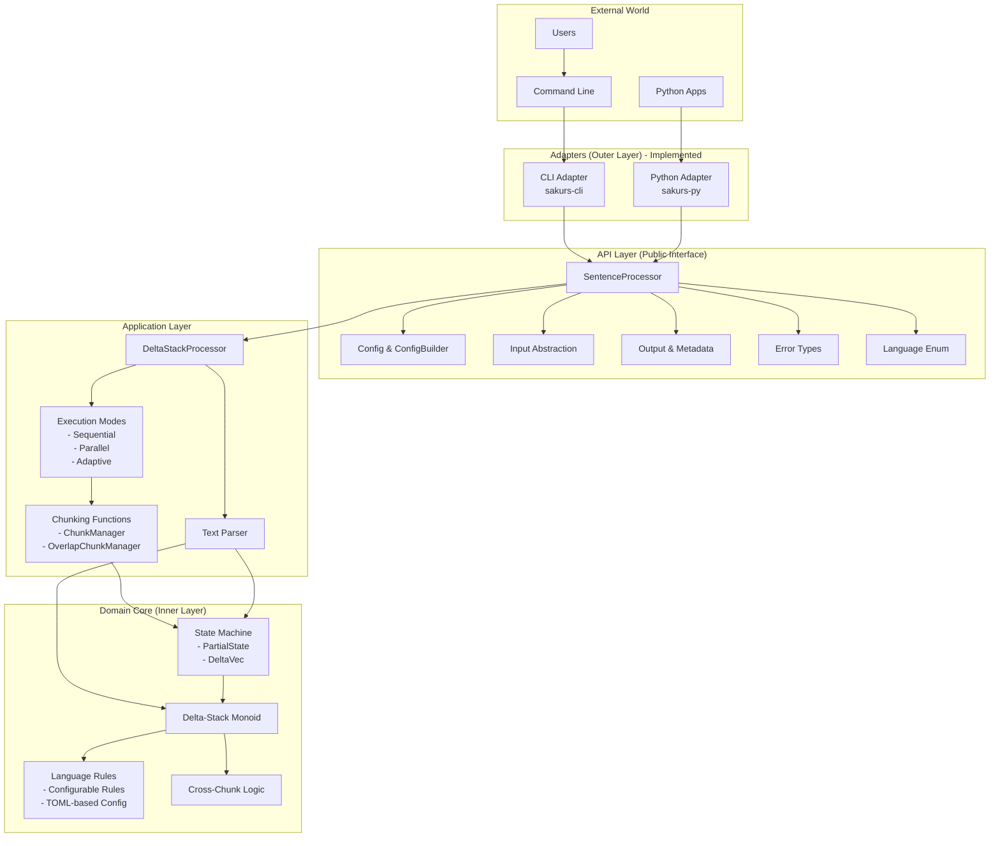
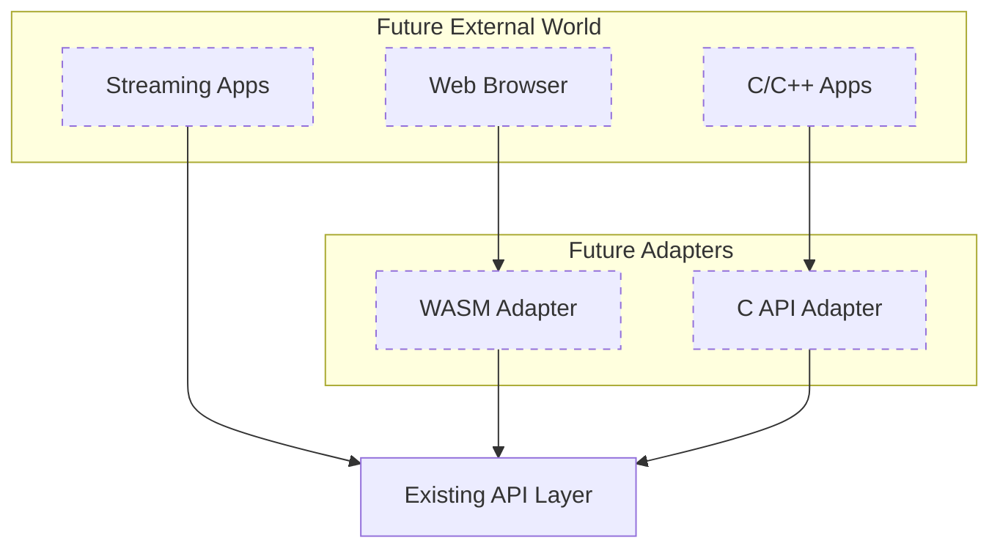

# Architecture Design

## Table of Contents

- [Overview](#overview)
  - [Why This Architecture?](#why-this-architecture)
- [System Architecture](#system-architecture)
  - [Future Architecture (Planned Extensions)](#future-architecture-planned-extensions)
- [Core Algorithm](#core-algorithm)
- [Key Design Decisions](#key-design-decisions)
  - [1. Hexagonal Architecture](#1-hexagonal-architecture)
  - [2. Rust for Core Implementation](#2-rust-for-core-implementation)
  - [3. Rayon for Parallelism](#3-rayon-for-parallelism)
  - [4. Language Rules as Traits with Configuration-Based Implementation](#4-language-rules-as-traits-with-configuration-based-implementation)
  - [5. Unified Public API](#5-unified-public-api)
  - [6. Simplified Execution Model](#6-simplified-execution-model)
- [Component Structure](#component-structure)
  - [API Layer](#api-layer-srcapi)
  - [Domain Layer](#domain-layer-srcdomain)
  - [Application Layer](#application-layer-srcapplication)
  - [Adapter Layer](#adapter-layer)
- [Language Configuration System](#language-configuration-system)
  - [Overview](#overview-1)
  - [Configuration Structure](#configuration-structure)
  - [Adding a New Language](#adding-a-new-language)
  - [Configuration Components](#configuration-components)
  - [Performance Optimizations](#performance-optimizations)
- [Performance Characteristics](#performance-characteristics)
  - [Memory Usage](#memory-usage)
  - [Time Complexity](#time-complexity)
  - [Optimization Strategies](#optimization-strategies)
  - [Planned Optimizations](#planned-optimizations)
- [Usage Examples](#usage-examples)
  - [Basic Usage (via API Layer)](#basic-usage-via-api-layer)
  - [CLI Usage](#cli-usage)
  - [Python Usage](#python-usage)
- [FAQ](#faq)
- [Implementation Status](#implementation-status)
  - [Current Features (v0.1.0-dev)](#current-features-v010-dev)
  - [Planned Features](#planned-features)
- [Contributing](#contributing)

## Overview

The Delta-Stack Monoid Sentence Boundary Detection (SBD) library is a high-performance, parallel text processing system designed to identify sentence boundaries in multiple languages. This document describes the architecture, design decisions, and extension points to help contributors understand and work with the codebase effectively.

### Why This Architecture?

We chose a **Hexagonal Architecture (Ports & Adapters)** pattern to achieve:

- **Clear separation of concerns** - Algorithm logic is isolated from I/O and language bindings
- **Easy testing** - Core logic can be tested without external dependencies
- **Multiple interfaces** - Same core supports CLI, Python, WASM, and streaming APIs
- **Future extensibility** - New languages and adapters can be added without modifying the core

## System Architecture



### Future Architecture (Planned Extensions)



Note: Streaming functionality is available through configuration presets that optimize chunk size and overlap for memory-efficient processing of large texts or continuous streams.

## Core Algorithm

The system is built around the **Delta-Stack Monoid** algorithm for parallel sentence boundary detection. For detailed mathematical foundation and implementation details, see [DELTA_STACK_ALGORITHM.md](DELTA_STACK_ALGORITHM.md).

## Key Design Decisions

### 1. Hexagonal Architecture

**Decision**: Separate domain logic from infrastructure concerns using Ports & Adapters pattern.

**Rationale**: 
- Allows pure functional core that's easy to test
- Enables multiple delivery mechanisms (CLI, Python, WASM) without duplicating logic
- Prepares for `no_std` support for embedded systems

**Trade-off**: More layers can be initially confusing for newcomers.

### 2. Rust for Core Implementation

**Decision**: Implement core algorithm in Rust with safe abstractions.

**Rationale**:
- Memory safety without garbage collection
- Zero-cost abstractions for performance
- Excellent FFI for Python/WASM bindings
- Strong ecosystem for parallel processing (rayon)

**Trade-off**: Steeper learning curve than Python/Go.

### 3. Rayon for Parallelism

**Decision**: Use rayon's work-stealing thread pool for parallel processing.

**Rationale**:
- Battle-tested in production
- Automatic load balancing
- Integrates well with Rust iterators

**Trade-off**: Not available in WASM (we fall back to sequential).

### 4. Language Rules as Traits with Configuration-Based Implementation

**Decision**: Define `LanguageRules` trait with configurable implementation loaded from TOML files.

**Rationale**:
- Easy to add new languages without modifying core - just add a TOML configuration file
- Community can contribute language implementations via simple configuration files
- Compile-time type safety with runtime configuration flexibility
- Embedded configurations at build time for zero runtime overhead
- Consistent rule structure across all languages

**Trade-off**: Requires careful trait design to remain stable and configuration schema versioning.

### 5. Unified Public API

**Decision**: Create a separate API layer (`src/api/`) as the public interface.

**Rationale**:
- Stable public interface independent of internal changes
- Simplified usage for external consumers
- Better encapsulation of implementation details
- Easier to maintain backward compatibility

**Trade-off**: Additional abstraction layer to maintain.

### 6. Simplified Execution Model

**Decision**: Use enum-based execution modes instead of strategy pattern.

**Rationale**:
- Eliminates virtual dispatch overhead for better performance
- Simpler to understand and maintain
- All execution modes share the same core Delta-Stack algorithm
- No loss of functionality - all modes still available
- Direct method dispatch enables compiler optimizations

**Trade-off**: Less extensible for adding new execution modes at runtime, but this is rarely needed in practice.

## Component Structure

### API Layer (`src/api/`)

The public interface that provides a clean, stable API for external consumers:

```rust
// Main entry point
pub struct SentenceProcessor {
    // Internal implementation details hidden
}

// Unified input handling
pub enum Input {
    Text(String),
    File(PathBuf),
    Bytes(Vec<u8>),
    Reader(Box<dyn Read>),
}

// Configuration with builder pattern
pub struct Config { /* fields */ }
pub struct ConfigBuilder { /* builder */ }

// Rich output information
pub struct Output {
    pub boundaries: Vec<Boundary>,
    pub metadata: ProcessingMetadata,
}
```

Key features:
- Hides internal implementation complexity
- Provides intuitive, type-safe API
- Supports configuration presets (fast, balanced, accurate)
- Unified error handling with domain-specific error types
- Rich output metadata including performance metrics
- Support for various input sources (text, files, readers, bytes)

### Domain Layer (`src/domain/`)

The pure business logic, no external dependencies:

```rust
// Core algorithm trait
pub trait Monoid {
    fn identity() -> Self;
    fn combine(&self, other: &Self) -> Self;
}

// Language-specific rules trait
pub trait LanguageRules: Send + Sync {
    fn is_sentence_boundary(&self, state: &PartialState, offset: usize) -> BoundaryDecision;
    fn process_character(&self, ch: char, context: &ProcessingContext) -> CharacterEffect;
    // ... other methods
}

// Configurable implementation that loads from embedded TOML
pub struct ConfigurableLanguageRules {
    config: &'static LanguageConfig,  // Embedded at compile time
    terminator_rules: TerminatorRules,
    ellipsis_rules: EllipsisRules,
    abbreviation_trie: AbbreviationTrie,
    enclosure_map: EnclosureMap,
    suppressor: Suppressor,
}
```

### Application Layer (`src/application/`)

Orchestrates the domain logic with various processing strategies:

```rust
// Delta-Stack processor with execution mode selection
pub struct DeltaStackProcessor {
    language_rules: Arc<dyn LanguageRules>,
    execution_mode: ExecutionMode,
}

// Execution modes (no virtual dispatch)
pub enum ExecutionMode {
    Sequential,
    Parallel { chunk_size: usize },
    Adaptive,
}

impl DeltaStackProcessor {
    pub fn process(&self, text: &str) -> Result<Vec<Boundary>> {
        match &self.execution_mode {
            ExecutionMode::Sequential => self.process_sequential(text),
            ExecutionMode::Parallel { chunk_size } => self.process_parallel(text, *chunk_size),
            ExecutionMode::Adaptive => self.process_adaptive(text),
        }
    }
}
```

Key responsibilities:
- Execution mode selection (sequential, parallel, adaptive)
- Chunk management at valid UTF-8 boundaries
- Cross-chunk boundary resolution
- Performance optimization
- Streaming support through overlap chunking configuration


### Adapter Layer

Each adapter provides a different interface to the API layer:

- **CLI** (`sakurs-cli/`): Command-line tool with file globbing, stdin support, and multiple output formats
- **Python** (`sakurs-py/`): PyO3 bindings with NLTK-compatible API and streaming support
- **WASM** (future): Browser-compatible with streaming support
- **C API** (future): For integration with other languages

Note: Streaming functionality is available through configuration presets that optimize for memory-efficient processing, accessible through all adapters.

## Language Configuration System

### Overview

Sakurs uses a TOML-based configuration system for language rules, enabling easy addition of new languages without code changes. Language configurations are embedded at compile time for zero runtime overhead.

### Configuration Structure

Each language configuration file (`configs/languages/{language}.toml`) contains:

```toml
[metadata]
code = "en"                    # ISO 639-1 language code
name = "English"               # Human-readable name

[terminators]
chars = [".", "!", "?"]        # Basic sentence-ending punctuation
patterns = [                   # Multi-character patterns
    { pattern = "!?", name = "surprised_question" },
    { pattern = "?!", name = "questioning_exclamation" }
]

[ellipsis]
treat_as_boundary = true       # Default ellipsis behavior
patterns = ["...", "…"]        # Ellipsis patterns to recognize
context_rules = [              # Context-based decisions
    { condition = "followed_by_capital", boundary = true },
    { condition = "followed_by_lowercase", boundary = false }
]
exceptions = [                 # Regex-based exceptions
    { regex = "\\b(um|uh|er)\\.\\.\\.", boundary = false }
]

[enclosures]
pairs = [                      # Paired delimiters
    { open = "(", close = ")" },
    { open = "[", close = "]" },
    { open = "'", close = "'", symmetric = true },
    { open = '"', close = '"', symmetric = true }
]

[suppression]
fast_patterns = [              # High-performance pattern matching
    { char = "'", before = "alpha", after = "alpha" },  # Contractions
    { char = ")", line_start = true, before = "alnum" } # List items
]

[abbreviations]
common = ["Dr", "Mr", "Mrs", "Ms", "Prof", "Inc", "Ltd", "Co"]
academic = ["Ph.D", "M.D", "B.A", "M.A", "B.S", "M.S"]
locations = ["St", "Ave", "Blvd", "Rd", "Ct", "Pl"]
# ... more categories
```

### Adding a New Language

1. Create a new TOML file in `sakurs-core/configs/languages/{language_code}.toml`
2. Define the language rules following the schema above
3. Add the configuration to the loader in `config/loader.rs`:
   ```rust
   embed_language_config!("de", "../../../../configs/languages/german.toml"),
   ```
4. The language is now available through the standard API

### Configuration Components

- **TerminatorRules**: Handles sentence-ending punctuation and patterns
- **EllipsisRules**: Context-aware ellipsis processing
- **AbbreviationTrie**: High-performance abbreviation lookup using Trie data structure
- **EnclosureMap**: Manages paired delimiters with automatic ID assignment
- **Suppressor**: Fast pattern matching for special cases (contractions, possessives)

### Performance Optimizations

- Configurations are embedded at compile time using `include_str!`
- ASCII lookup tables for O(1) character classification
- Trie structure for efficient abbreviation matching
- Minimal runtime overhead - configurations are parsed once at startup

## Performance Characteristics

### Memory Usage

- **Sequential mode**: O(1) - Only current position state
- **Parallel mode**: O(P) - One state per thread
- **Streaming mode**: O(W) - Window size only

### Time Complexity

- **Sequential**: O(N) - Linear scan
- **Parallel**: O(N/P + log P) - Near-linear speedup

### Optimization Strategies

1. **Zero-copy string handling** - Minimizes allocations
2. **Cache-aware chunking** - Chunks fit in L2 cache
3. **Lock-free combining** - Tree reduction without mutexes
4. **UTF-8 safe chunking** - Ensures valid boundaries for all operations

### Planned Optimizations

1. **SIMD for character scanning** - Will use AVX2/NEON when available (not yet implemented)
2. **Memory prefetching** - Optimize cache line usage
3. **Vectorized terminal detection** - Batch process punctuation marks


## Usage Examples

### Basic Usage (via API Layer)

```rust
use sakurs_core::api::{SentenceProcessor, Input};

// Simple usage
let processor = SentenceProcessor::with_language("en")?;
let output = processor.process(Input::from_text("Hello world. How are you?"))?;

for boundary in &output.boundaries {
    println!("Sentence ends at byte offset: {}", boundary.offset);
    println!("Sentence ends at char offset: {}", boundary.char_offset);
}

// Advanced usage with custom configuration
use sakurs_core::api::Config;

let config = Config::builder()
    .language("ja")?
    .threads(Some(4))
    .build()?;

let processor = SentenceProcessor::with_config(config)?;

// Streaming usage for large files or continuous input
let config = Config::streaming()
    .language("en")?
    .build()?;

let processor = SentenceProcessor::with_config(config)?;
// Process large files or streams with memory-efficient chunking
let output = processor.process(Input::from_file("large_document.txt"))?;
```

### CLI Usage

```bash
# Process files
sakurs process -i "*.txt" -f json

# Process from stdin
echo "Hello world." | sakurs process -i -

# Japanese text with custom settings
sakurs process -i doc.txt -l japanese --parallel
```

### Python Usage

```python
import sakurs

# NLTK-compatible API
sentences = sakurs.sent_tokenize(text, "en")

# Advanced usage
processor = sakurs.load("ja")
result = processor.process(text)
```

## FAQ

### Q: Why not use regex for sentence detection?

Regex cannot handle nested delimiters (parentheses within quotes within parentheses) correctly. Our state machine approach handles arbitrary nesting.

### Q: How does cross-chunk abbreviation detection work?

We track "dangling dots" at chunk boundaries and look ahead in the next chunk for alphabetic characters. If found, we merge the boundary.

### Q: Why a separate API layer?

The API layer provides a stable public interface that shields users from internal implementation changes. This allows us to refactor and optimize internals without breaking existing code.

### Q: Can I use this in production?

Yes! The library is designed for production use with:
- Comprehensive error handling
- Graceful degradation
- Extensive testing
- Performance monitoring hooks

## Implementation Status

### Current Features (v0.1.0-dev)
- ✅ Core Delta-Stack Monoid algorithm
- ✅ Parallel processing with rayon
- ✅ English and Japanese language support via configurable rules
- ✅ Unified API layer with clean public interface
- ✅ CLI adapter with stdin/file/glob support
- ✅ Python bindings with NLTK compatibility
- ✅ Streaming support via configuration presets
- ✅ Adaptive execution mode with automatic selection
- ✅ Simplified execution model with enum-based modes
- ✅ Consolidated processing pipeline
- ✅ Cross-chunk boundary handling
- ✅ UTF-8 safe chunking
- ✅ Simple and flexible configuration API
- ✅ Configurable language rules system with TOML-based configuration

### Planned Features
- 🚧 WASM adapter for browser support
- 🚧 C API for other language bindings
- 🚧 Additional language rules (German, French, Spanish) - easily addable via TOML configs
- 🚧 Runtime plugin system for dynamic language rule loading
- 🚧 SIMD optimizations for character scanning
- 🚧 GPU acceleration for very large texts

## Contributing

See [CONTRIBUTING.md](../../CONTRIBUTING.md) for development setup and guidelines.

Key areas for contribution:
- Language rule implementations via TOML configurations (see [Adding Languages](../ADDING_LANGUAGES.md))
- Performance optimizations
- Documentation improvements
- Test coverage expansion
- WASM adapter implementation
