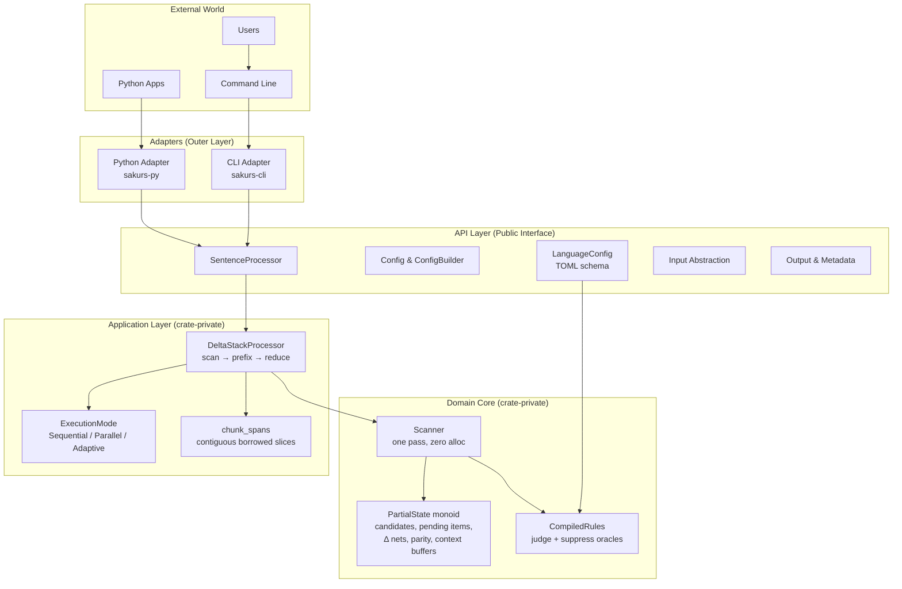

# Architecture Design

## Table of Contents

- [Overview](#overview)
  - [Why This Architecture?](#why-this-architecture)
- [System Architecture](#system-architecture)
  - [Future Architecture (Planned Extensions)](#future-architecture-planned-extensions)
- [Core Algorithm](#core-algorithm)
- [Key Design Decisions](#key-design-decisions)
  - [1. Hexagonal Architecture](#1-hexagonal-architecture)
  - [2. Rust for Core Implementation](#2-rust-for-core-implementation)
  - [3. Rayon for Parallelism](#3-rayon-for-parallelism)
  - [4. Languages as Compiled TOML Configurations](#4-languages-as-compiled-toml-configurations)
  - [5. Unified Public API](#5-unified-public-api)
  - [6. Simplified Execution Model](#6-simplified-execution-model)
- [Component Structure](#component-structure)
  - [API Layer](#api-layer-srcapi)
  - [Domain Layer](#domain-layer-srcdomain)
  - [Application Layer](#application-layer-srcapplication)
  - [Adapter Layer](#adapter-layer)
- [Language Configuration System](#language-configuration-system)
  - [Configuration Structure](#configuration-structure)
  - [Adding a New Language](#adding-a-new-language)
  - [Compilation and the Judgment Window](#compilation-and-the-judgment-window)
- [Performance Characteristics](#performance-characteristics)
- [Usage Examples](#usage-examples)
  - [Basic Usage (via API Layer)](#basic-usage-via-api-layer)
  - [CLI Usage](#cli-usage)
  - [Python Usage](#python-usage)
- [FAQ](#faq)
- [Implementation Status](#implementation-status)
- [Contributing](#contributing)

## Overview

Sakurs is a high-performance, parallel sentence boundary detection (SBD) library. Its core is the Δ-Stack Monoid algorithm (see [DELTA_STACK_ALGORITHM.md](DELTA_STACK_ALGORITHM.md)), which formulates SBD as an associative combine over per-chunk states, so chunked and parallel processing produce exactly the same boundaries as a sequential scan. This document describes the code architecture around that algorithm and the extension points for contributors.

### Why This Architecture?

We chose a **Hexagonal Architecture (Ports & Adapters)** pattern to achieve:

- **Clear separation of concerns** - Algorithm logic is isolated from I/O and language bindings
- **Easy testing** - Core logic can be tested without external dependencies
- **Multiple interfaces** - Same core supports CLI, Python, and future adapters
- **Future extensibility** - New languages are TOML files; new adapters depend only on the API layer

## System Architecture


```mermaid
graph TB
    subgraph "External World"
        USER[Users]
        PY[Python Apps]
        CLI[Command Line]
    end

    subgraph "Adapters (Outer Layer)"
        ADP_CLI[CLI Adapter<br/>sakurs-cli]
        ADP_PY[Python Adapter<br/>sakurs-py]
    end

    subgraph "API Layer (Public Interface)"
        API[SentenceProcessor]
        CFG[Config & ConfigBuilder]
        LCFG[LanguageConfig<br/>TOML schema]
        IN[Input Abstraction]
        OUT[Output & Metadata]
    end

    subgraph "Application Layer (crate-private)"
        APP[DeltaStackProcessor<br/>scan → prefix → reduce]
        MODE[ExecutionMode<br/>Sequential / Parallel / Adaptive]
        CHUNK[chunk_spans<br/>contiguous borrowed slices]
    end

    subgraph "Domain Core (crate-private)"
        STATE[PartialState monoid<br/>candidates, pending items,<br/>Δ nets, parity, context buffers]
        SCAN[Scanner<br/>one pass, zero alloc]
        RULES[CompiledRules<br/>judge + suppress oracles]
    end

    USER --> CLI
    CLI --> ADP_CLI
    PY --> ADP_PY

    ADP_CLI --> API
    ADP_PY --> API

    API --> APP
    APP --> MODE
    APP --> CHUNK
    APP --> SCAN
    SCAN --> STATE
    SCAN --> RULES
    LCFG --> RULES
```

### Future Architecture (Planned Extensions)

WASM and C-API adapters are planned; both would sit next to the CLI/Python adapters and depend only on the API layer.

## Core Algorithm

The system is built around the **Δ-Stack Monoid** algorithm for parallel sentence boundary detection with a sequential-equivalence guarantee. For the data structures (pending candidates and enclosures, context buffers, delta/parity state), the combine operation, and the correctness argument, see [DELTA_STACK_ALGORITHM.md](DELTA_STACK_ALGORITHM.md) — the implementation in `sakurs-core/src/domain/state/` follows it directly.

## Key Design Decisions

### 1. Hexagonal Architecture

**Decision**: Separate domain logic from infrastructure concerns using Ports & Adapters.

**Rationale**: pure, independently testable core; multiple delivery mechanisms without duplicating logic.

**Trade-off**: more layers can be initially confusing for newcomers.

### 2. Rust for Core Implementation

**Decision**: Implement the core in Rust with safe abstractions.

**Rationale**: memory safety without garbage collection, zero-cost abstractions, excellent FFI for Python/WASM, strong parallel ecosystem (rayon).

**Trade-off**: steeper learning curve than Python/Go.

### 3. Rayon for Parallelism

**Decision**: Use rayon's work-stealing thread pool for the parallel phases.

**Rationale**: battle-tested, automatic load balancing, integrates with Rust iterators.

**Trade-off**: not available in WASM (sequential fallback).

### 4. Languages as Compiled TOML Configurations

**Decision**: A language is a TOML configuration file, compiled at load time into the two pure decision oracles the algorithm needs (boundary judgment and enclosure suppression).

**Rationale**:

- Adding a language requires no code — just a TOML file (bundled configurations are embedded at compile time; external files load at runtime)
- One implementation for all languages: the compiled oracles are the only rules engine, so single-chunk and multi-chunk processing share the exact same decision code by construction
- Compilation validates the configuration up front, including that every rule's context need fits the algorithm's judgment window — a configuration that could break sequential equivalence is rejected at load time instead of surfacing as wrong output

**Trade-off**: rule expressiveness is bounded by the schema and the judgment window; features needing unbounded context (deeply nested same-character quotes, URL grammar) are out of scope for the rule engine.

### 5. Unified Public API

**Decision**: The public surface is the `api` module (re-exported at the crate root); `application` and `domain` are crate-private.

**Rationale**: a stable, small interface lets internals change without breaking consumers; the 0.2 series is the first pass at this stability.

**Trade-off**: an additional abstraction layer to maintain.

### 6. Simplified Execution Model

**Decision**: Enum-based execution modes (`Sequential`, `Parallel`, `Adaptive`) instead of a strategy pattern.

**Rationale**: no virtual dispatch, simple to understand, all modes share the same pipeline; `Adaptive` picks a thread count from the text size.

**Trade-off**: less runtime extensibility, which has not been needed.

## Component Structure

### API Layer (`src/api/`)

The public interface:

```rust
pub struct SentenceProcessor { /* … */ }

impl SentenceProcessor {
    pub fn new() -> Self;
    pub fn with_language(code: impl Into<String>) -> Result<Self, Error>;
    pub fn with_config(config: Config) -> Result<Self, Error>;
    pub fn with_language_config(config: Config, language: &LanguageConfig) -> Result<Self, Error>;
    pub fn process(&self, input: Input) -> Result<Output, Error>;
}

pub enum Input { Text(String), File(PathBuf), Bytes(Vec<u8>), Reader(Box<dyn Read>) }

pub struct Output {
    pub boundaries: Vec<Boundary>,   // { offset, char_offset }
    pub metadata: ProcessingMetadata,
}
```

`Config` (via `ConfigBuilder`) selects the language, thread count, and chunk size, and offers presets (`small_text`, `large_text`, `streaming`). `LanguageConfig` is the TOML schema, loadable from external files with `LanguageConfig::from_file`; the schema types live in `api::language_config` for programmatic construction (used by the Python bindings).

### Domain Layer (`src/domain/`)

Crate-private. `domain::state` implements the algorithm document:

- `PartialState` — the monoid state ⟨B, P, E, Δ, π, H, T⟩ with `absorb` (in-place combine) and edge resolution; associativity and single-chunk equivalence are property-tested with judgment functions that are sensitive to every byte of the decision window
- `scanner` — the one-pass scan: table-driven character classification, inline judgment on borrowed windows for interior items, pending items near chunk edges, zero per-character allocation
- `compiled` — `CompiledRules`: a TOML configuration compiled into the `judge`/`suppress_enclosure` oracles (reverse-trie abbreviation matcher, terminator/ellipsis tables, `RegexSet` suppression, sentence-starter sets) plus the character classification the scanner consumes

`domain::language::config` holds the TOML schema, validation, embedded bundled configurations, and file loading.

### Application Layer (`src/application/`)

Crate-private orchestration in `DeltaStackProcessor`:

1. **Scan**: split the text into contiguous borrowed spans (`chunk_spans`, UTF-8 snapped, zero-copy) and scan them into partial states — in parallel when the execution mode says so
2. **Prefix**: fold per-chunk aggregates left-to-right, resolving pending items with neighboring context, then resolve the text edges
3. **Reduce**: rebase and filter each chunk's candidates against the cumulative state — embarrassingly parallel

### Adapter Layer

- **CLI** (`sakurs-cli/`): file globbing, stdin, text/JSON/markdown output, external language configs (`--language-config`), streaming mode for very large files
- **Python** (`sakurs-py/`): PyO3 bindings with an NLTK-compatible API, custom language configurations, iterator-based streaming
- **WASM / C API**: planned

## Language Configuration System

### Configuration Structure

Each language configuration file (`configs/languages/{language}.toml`) contains:

```toml
[metadata]
code = "en"                    # ISO 639-1 language code
name = "English"               # Human-readable name

[terminators]
chars = [".", "!", "?"]        # Sentence-ending punctuation
patterns = [                   # Multi-character patterns
    { pattern = "!?", name = "surprised_question" },
]
boundary_after_closers = true  # Boundary after closers following a terminator
                               # ('great." She' → boundary after the quote)

[ellipsis]
treat_as_boundary = true       # Default ellipsis behavior
patterns = ["...", "…"]
context_rules = [              # Context-based decisions
    { condition = "followed_by_capital", boundary = true },
    { condition = "followed_by_lowercase", boundary = false },
]
exceptions = [                 # Regex-based exceptions
    { regex = "\\b(um|uh|er)\\.\\.\\.", boundary = false },
]

[enclosures]
pairs = [                      # Paired delimiters; symmetric = same char opens and closes
    { open = "(", close = ")" },
    { open = "'", close = "'", symmetric = true },
]

[suppression]
fast_patterns = [              # Exclude non-enclosure uses from depth tracking
    { char = "'", before = "alpha", after = "alpha" },   # Contractions
]
regex_patterns = [             # Applied to a small window around any enclosure char
    { pattern = "\\d+'", description = "Feet measurement like 6'" },
]

[abbreviations]
titles = ["Dr", "Mr", "Mrs", "Prof"]    # Categories are free-form
locations = ["St", "Ave"]

[sentence_starters]            # Words that can begin a sentence after an abbreviation
common = ["The", "He", "She"]
```

### Adding a New Language

1. Create a TOML file following the schema (see [ADDING_LANGUAGES.md](ADDING_LANGUAGES.md))
2. For a bundled language: add it to the embedded set in `domain/language/config/loader.rs`
3. For an external language: no code at all — `sakurs process --language-config path/to/lang.toml`, `LanguageConfig::from_file`, or the Python `language_config` parameter
4. Validate with `sakurs validate -c path/to/lang.toml`, which also compiles the configuration

### Compilation and the Judgment Window

Configurations are compiled once into flat, allocation-free structures: an ASCII classification table with a small non-ASCII map, terminator and ellipsis tables, a reverse trie over abbreviation entries, compiled regexes, and enclosure slot assignments (asymmetric pairs get depth counters, symmetric pairs get parity bits). Compilation derives the configuration's required context window (longest abbreviation, starter, pattern, regex reach) and rejects configurations exceeding the algorithm's judgment window `k`, which is what keeps every rule compatible with the sequential-equivalence guarantee (see the algorithm guide).

## Performance Characteristics

- **Time**: O(N) sequential; O(N/P + P) parallel with near-linear scaling (measured: 71% efficiency at 8 threads)
- **Memory**: input text + O(P) small scan states + boundary storage; no per-character allocation
- **Chunk-size independence**: per-character work is constant, so throughput is flat across chunk sizes and correctness never depends on where chunks are cut
- **Determinism**: no model, no randomness, no execution-order dependence

Measured numbers and tuning guidance live in [PERFORMANCE.md](PERFORMANCE.md). Planned optimizations: SIMD character scanning, memory prefetching.

## Usage Examples

### Basic Usage (via API Layer)

```rust
use sakurs_core::{Config, Input, LanguageConfig, SentenceProcessor};

// Simple usage
let processor = SentenceProcessor::with_language("en")?;
let output = processor.process(Input::from_text("Hello world. How are you?"))?;
for boundary in &output.boundaries {
    println!("byte {} / char {}", boundary.offset, boundary.char_offset);
}

// Custom configuration
let config = Config::builder().language("ja")?.threads(Some(4)).build()?;
let processor = SentenceProcessor::with_config(config)?;

// External language definition
let lang = LanguageConfig::from_file("my_language.toml".as_ref(), None)?;
let processor = SentenceProcessor::with_language_config(Config::default(), &lang)?;
```

### CLI Usage

```bash
# Process files
sakurs process -i "*.txt" -f json

# Process from stdin
echo "Hello world." | sakurs process -i -

# Japanese text, explicit parallelism
sakurs process -i doc.txt -l japanese --threads 8

# External language configuration
sakurs process -i doc.txt --language-config my_language.toml
```

### Python Usage

```python
import sakurs

# NLTK-compatible API
sentences = sakurs.split(text, language="en")

# Advanced usage
processor = sakurs.load("ja")
result = processor.split(text)
```

## FAQ

### Q: Why not use regex for sentence detection?

Regex cannot handle nested delimiters (parentheses within quotes within parentheses) correctly. The depth/parity state machine handles arbitrary nesting of asymmetric pairs.

### Q: How do decisions that span chunk boundaries work?

Every decision is a pure function of a bounded window around the character. When the window crosses a chunk edge, the item is carried as *pending* in the chunk's state and resolved during the combine step, where the neighboring chunk's context is available — so the verdict is identical to the sequential scan's. This covers abbreviations like "U.S." split across chunks, sentence starters just past an edge, and apostrophes whose contraction-vs-quote status is decided by the next character.

### Q: Why a separate API layer?

The API layer shields users from internal changes: everything else is crate-private, so refactoring and optimizing internals is non-breaking by construction.

### Q: Can I use this in production?

Yes, within its scope: rule-based segmentation of well-punctuated text, with deterministic output, comprehensive error handling, and extensive property-based testing. For heavily malformed text (no punctuation, all-lowercase), ML-based segmenters are the better tool.

## Implementation Status

### Current Features (v0.2.0)

- ✅ Δ-Stack Monoid core with deferred judgment and a property-tested sequential-equivalence guarantee
- ✅ Parallel processing with rayon (parallel scan + parallel reduce)
- ✅ English and Japanese bundled; external languages via TOML at runtime
- ✅ Load-time validation that a configuration fits the judgment window
- ✅ Unified API layer; CLI adapter (stdin/file/glob, JSON/text/markdown); Python bindings with NLTK-compatible API
- ✅ Zero-copy chunking, allocation-free scan hot path
- ✅ Streaming via configuration presets and the CLI/Python streaming modes

### Planned Features

- 🚧 WASM adapter for browser support
- 🚧 C API for other language bindings
- 🚧 Additional bundled languages (German, French, Spanish, …) via TOML configs
- 🚧 SIMD optimizations for character scanning

## Contributing

See [CONTRIBUTING.md](../CONTRIBUTING.md) for development setup and guidelines.

Key areas for contribution:
- Language configurations (see [ADDING_LANGUAGES.md](ADDING_LANGUAGES.md))
- Performance optimizations
- Documentation improvements
- WASM adapter implementation
