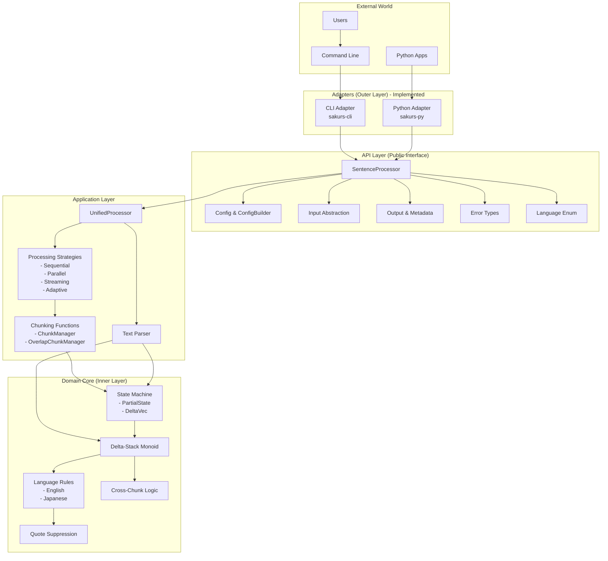

# Architecture Design

## Overview

The Delta-Stack Monoid Sentence Boundary Detection (SBD) library is a high-performance, parallel text processing system designed to identify sentence boundaries in multiple languages. This document describes the architecture, design decisions, and extension points to help contributors understand and work with the codebase effectively.

### Why This Architecture?

We chose a **Hexagonal Architecture (Ports & Adapters)** pattern to achieve:

- **Clear separation of concerns** - Algorithm logic is isolated from I/O and language bindings
- **Easy testing** - Core logic can be tested without external dependencies
- **Multiple interfaces** - Same core supports CLI, Python, WASM, and streaming APIs
- **Future extensibility** - New languages and adapters can be added without modifying the core

## System Architecture



### Future Architecture (Planned)


Note: Streaming functionality is currently available through the existing adapters via the streaming processing strategy.

## Core Algorithm

The system is built around the **Delta-Stack Monoid** algorithm for parallel sentence boundary detection. For detailed mathematical foundation and implementation details, see [DELTA_STACK_ALGORITHM.md](DELTA_STACK_ALGORITHM.md).

## Key Design Decisions

### 1. Hexagonal Architecture

**Decision**: Separate domain logic from infrastructure concerns using Ports & Adapters pattern.

**Rationale**: 
- Allows pure functional core that's easy to test
- Enables multiple delivery mechanisms (CLI, Python, WASM) without duplicating logic
- Prepares for `no_std` support for embedded systems

**Trade-off**: More layers can be initially confusing for newcomers.

### 2. Rust for Core Implementation

**Decision**: Implement core algorithm in Rust with safe abstractions.

**Rationale**:
- Memory safety without garbage collection
- Zero-cost abstractions for performance
- Excellent FFI for Python/WASM bindings
- Strong ecosystem for parallel processing (rayon)

**Trade-off**: Steeper learning curve than Python/Go.

### 3. Rayon for Parallelism

**Decision**: Use rayon's work-stealing thread pool for parallel processing.

**Rationale**:
- Battle-tested in production
- Automatic load balancing
- Integrates well with Rust iterators

**Trade-off**: Not available in WASM (we fall back to sequential).

### 4. Language Rules as Traits

**Decision**: Define `LanguageRules` trait for language-specific logic.

**Rationale**:
- Easy to add new languages without modifying core
- Community can contribute language implementations
- Compile-time type safety
- Future support for runtime plugin loading

**Trade-off**: Requires careful trait design to remain stable.

### 5. Unified Public API

**Decision**: Create a separate API layer (`src/api/`) as the public interface.

**Rationale**:
- Stable public interface independent of internal changes
- Simplified usage for external consumers
- Better encapsulation of implementation details
- Easier to maintain backward compatibility

**Trade-off**: Additional abstraction layer to maintain.

## Component Structure

### API Layer (`src/api/`)

The public interface that provides a clean, stable API for external consumers:

```rust
// Main entry point
pub struct SentenceProcessor {
    // Internal implementation details hidden
}

// Unified input handling
pub enum Input {
    Text(String),
    File(PathBuf),
    Bytes(Vec<u8>),
    Reader(Box<dyn Read>),
}

// Configuration with builder pattern
pub struct Config { /* fields */ }
pub struct ConfigBuilder { /* builder */ }

// Rich output information
pub struct Output {
    pub boundaries: Vec<Boundary>,
    pub metadata: ProcessingMetadata,
}
```

Key features:
- Hides internal implementation complexity
- Provides intuitive, type-safe API
- Supports configuration presets (fast, balanced, accurate)
- Unified error handling with domain-specific error types
- Rich output metadata including performance metrics
- Support for various input sources (text, files, readers, bytes)

### Domain Layer (`src/domain/`)

The pure business logic, no external dependencies:

```rust
// Core algorithm trait
pub trait Monoid {
    fn identity() -> Self;
    fn combine(&self, other: &Self) -> Self;
}

// Language-specific rules
pub trait LanguageRules: Send + Sync {
    fn is_sentence_boundary(&self, state: &PartialState, offset: usize) -> BoundaryDecision;
    fn process_character(&self, ch: char, context: &ProcessingContext) -> CharacterEffect;
    // ... other methods
}
```

### Application Layer (`src/application/`)

Orchestrates the domain logic with various processing strategies:

```rust
// Unified processor that delegates to strategies
pub struct UnifiedProcessor {
    rules: Arc<dyn LanguageRules>,
    config: ProcessingConfig,
}

// Processing strategies
pub trait ProcessingStrategy: Send + Sync {
    fn process(&self, input: StrategyInput, 
               language_rules: Arc<dyn LanguageRules>,
               config: &ProcessingConfig) -> Result<StrategyOutput>;
    fn suitability_score(&self, characteristics: &InputCharacteristics) -> f32;
    fn supports_streaming(&self) -> bool;
}
```

Key responsibilities:
- Strategy selection (sequential, parallel, streaming, adaptive)
- Chunk management at valid UTF-8 boundaries
- Cross-chunk boundary resolution
- Performance optimization


### Adapter Layer

Each adapter provides a different interface to the API layer:

- **CLI** (`sakurs-cli/`): Command-line tool with file globbing, stdin support, and multiple output formats
- **Python** (`sakurs-py/`): PyO3 bindings with NLTK-compatible API and streaming support
- **WASM** (future): Browser-compatible with streaming support
- **C API** (future): For integration with other languages

Note: Streaming functionality is currently implemented as a processing strategy within the application layer, accessible through all adapters.

## Performance Characteristics

### Memory Usage

- **Sequential mode**: O(1) - Only current position state
- **Parallel mode**: O(P) - One state per thread
- **Streaming mode**: O(W) - Window size only

### Time Complexity

- **Sequential**: O(N) - Linear scan
- **Parallel**: O(N/P + log P) - Near-linear speedup

### Optimization Strategies

1. **Zero-copy string handling** - Minimizes allocations
2. **Cache-aware chunking** - Chunks fit in L2 cache
3. **Lock-free combining** - Tree reduction without mutexes
4. **UTF-8 safe chunking** - Ensures valid boundaries for all operations

### Planned Optimizations

1. **SIMD for character scanning** - Will use AVX2/NEON when available (not yet implemented)
2. **Memory prefetching** - Optimize cache line usage
3. **Vectorized terminal detection** - Batch process punctuation marks


## Usage Examples

### Basic Usage (via API Layer)

```rust
use sakurs_core::api::{SentenceProcessor, Input};

// Simple usage
let processor = SentenceProcessor::for_language("en")?;
let output = processor.process(Input::from_text("Hello world. How are you?"))?;

for boundary in &output.boundaries {
    println!("Sentence ends at byte offset: {}", boundary.offset);
    println!("Sentence ends at char offset: {}", boundary.char_offset);
}

// Advanced usage with custom configuration
use sakurs_core::api::Config;

let config = Config::builder()
    .language("ja")?
    .threads(Some(4))
    .build()?;

let processor = SentenceProcessor::with_config(config)?;
```

### CLI Usage

```bash
# Process files
sakurs process -i "*.txt" -f json

# Process from stdin
echo "Hello world." | sakurs process -i -

# Japanese text with custom settings
sakurs process -i doc.txt -l japanese --parallel
```

### Python Usage

```python
import sakurs

# NLTK-compatible API
sentences = sakurs.sent_tokenize(text, "en")

# Advanced usage
processor = sakurs.load("ja")
result = processor.process(text)
```

## FAQ

### Q: Why not use regex for sentence detection?

Regex cannot handle nested delimiters (parentheses within quotes within parentheses) correctly. Our state machine approach handles arbitrary nesting.

### Q: How does cross-chunk abbreviation detection work?

We track "dangling dots" at chunk boundaries and look ahead in the next chunk for alphabetic characters. If found, we merge the boundary.

### Q: Why a separate API layer?

The API layer provides a stable public interface that shields users from internal implementation changes. This allows us to refactor and optimize internals without breaking existing code.

### Q: Can I use this in production?

Yes! The library is designed for production use with:
- Comprehensive error handling
- Graceful degradation
- Extensive testing
- Performance monitoring hooks

## Implementation Status

### Current Features (v0.1.0)
- ✅ Core Delta-Stack Monoid algorithm
- ✅ Parallel processing with rayon
- ✅ English and Japanese language support
- ✅ Unified API layer with clean public interface
- ✅ CLI adapter with stdin/file/glob support
- ✅ Python bindings with NLTK compatibility
- ✅ Streaming processing strategy
- ✅ Adaptive strategy selection
- ✅ Cross-chunk boundary handling
- ✅ UTF-8 safe chunking
- ✅ Simple and flexible configuration API

### Planned Features
- 🚧 WASM adapter for browser support
- 🚧 C API for other language bindings
- 🚧 Additional language rules (German, French, Spanish)
- 🚧 Runtime plugin system for language rules
- 🚧 SIMD optimizations for character scanning
- 🚧 GPU acceleration for very large texts

## Contributing

See [CONTRIBUTING.md](../../CONTRIBUTING.md) for development setup and guidelines.

Key areas for contribution:
- Language rule implementations
- Performance optimizations
- Documentation improvements
- Test coverage expansion
- WASM adapter implementation
