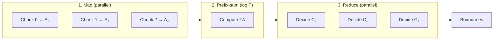

# Δ-Stack Monoid Algorithm

## Overview

The Δ-Stack Monoid algorithm enables parallel sentence boundary detection (SBD) by formulating it as an associative monoid operation. This allows text to be processed in chunks across multiple cores while maintaining perfect accuracy—a critical feature for Sakurs' high-performance text segmentation.

## Why Monoids?

A monoid's associativity property `(a ⊕ b) ⊕ c = a ⊕ (b ⊕ c)` means we can:
1. Split text into chunks
2. Process chunks independently on different cores
3. Combine results in any order
4. Get identical results to sequential processing

This mathematical guarantee enables true parallelism without compromising correctness.

## Core Data Structure

The algorithm represents parsing state as a triple `State = ⟨B, Δ, A⟩`:

### 1. Boundaries (B)
Stores detected sentence boundaries with metadata:
```
B = {(offset, flags) | offset ∈ ℕ, flags ∈ {STRONG, FROM_ABBR}}
```

### 2. Delta Stack (Δ) - The Key Innovation
Tracks enclosure depth changes without storing full state:
```
Δ = [(net, min) | for each enclosure type]
```
- `net`: Net change in depth (opens - closes)
- `min`: Minimum depth reached in chunk

This compact representation enables O(1) boundary decisions during parallel reduction.

### 3. Abbreviation State (A)
Handles cross-chunk abbreviations:
```
A = (dangling_dot, head_alpha)
```
Detects patterns like "U.S." split across chunks.

## Monoid Operations

**Identity**: `e = ⟨∅, 0⃗, (false, false)⟩` (empty text)

**Combine (⊕)**: Merges adjacent chunk states:
```python
def combine(state1, state2):
    return State(
        merge_boundaries(state1.B, state2.B, state1.A, state2.A),
        merge_deltas(state1.Δ, state2.Δ),
        merge_abbr(state1.A, state2.A)
    )
```

The critical delta merge formula:
```python
def merge_deltas(Δ1, Δ2):
    return [(net1 + net2, min(min1, net1 + min2)) 
            for (net1, min1), (net2, min2) in zip(Δ1, Δ2)]
```

This elegantly tracks nested enclosures across chunk boundaries without global state.

## Example: Parallel Boundary Detection

Consider text with nested parentheses:
```
(abc. def). ghi. jkl
```

The string is split into three equal‑sized chunks by the runtime:

| Chunk | Raw text | Local Δ `(net, min)` | Candidate boundaries (byte offsets*) |
| --- | --- | --- | --- |
| C₀ | `(abc.` | `(+1, 0)` | `5` (after the dot) |
| C₁ | ` def). ghi` | `(−1, −1)` | `11` (after the dot) |
| C₂ | `. jkl` | `(0, 0)` | `17` (after the dot) |

*Offsets are relative to the start of the **combined** three‑chunk buffer for easier comparison.

**Step 1: Parallel prefix-sum** computes cumulative deltas:
```
ΣΔ_before = [0, +1, 0]  // Before chunks C₀, C₁, C₂
```

**Step 2: Each chunk decides independently**:

Each chunk independently decides whether to accept or suppress its candidate boundaries:

| Chunk | Depth at candidate = `ΣΔ_before` + partial Δ | Decision |
| --- | --- | --- |
| C₀ | `0 + (+1) = 1 (>0)` | Suppress (inside parentheses) |
| C₁ | `+1 + (−1) = 0 (=0)` | **Accept** (at depth 0) |
| C₂ | `0 + 0 = 0 (=0)` | **Accept** (at depth 0) |

Key insight: Each chunk needs only two values—its local Δ and the prefix-sum—to make O(1) boundary decisions. This enables embarrassingly parallel reduction.

## Three-Phase Processing



1. **Map**: Independent chunk scanning → local deltas
2. **Prefix-sum**: O(log P) synchronization → cumulative deltas
3. **Reduce**: Independent boundary decisions → final results

## Implementation Highlights

### Map Phase (Per Chunk)
```rust
for (i, ch) in chunk.char_indices() {
    // Update enclosure depths
    if let Some(id) = config.open_id(ch) {
        depth[id] += 1;
        total_depth += 1;
    } else if let Some(id) = config.close_id(ch) {
        depth[id] -= 1;
        total_depth -= 1;
        min_prefix[id] = min_prefix[id].min(depth[id]);
    }
    // Mark boundaries only at depth 0
    else if config.is_terminator(ch) && total_depth == 0 {
        state.add_boundary(i + ch.len_utf8());
    }
}
```

### Tree Reduction (O(log P))
```rust
while level.len() > 1 {
    for chunk in level.chunks(2) {
        next_level.push(chunk[0].combine(chunk[1]));
    }
    level = next_level;
}
```

## Complex Case Handling

### Nested Quotations
Japanese example: 「彼は『こんにちは』と言った」
- Each quote type gets separate depth tracking
- Boundaries only at total depth = 0
- Delta representation preserves nesting across chunks

### Cross-Chunk Abbreviations
Example: "U.S." split as "U." | "S."
- Left chunk: `dangling_dot = true`
- Right chunk: `head_alpha = true`
- Merge: Remove false boundary if both conditions met

## Performance

| Metric | Sequential | Parallel |
|--------|------------|----------|
| Time | O(N) | O(N/P + log P) |
| Space | O(1) | O(P) |
| Speedup | 1× | Near-linear up to P cores |

Optimizations:
- Single-pass scanning
- Cache-friendly sequential access
- SIMD-capable character matching
- Lock-free map phase

## Key Implementation Details

### UTF-8 Safety
```rust
// Backtrack to valid UTF-8 boundary
while pos > 0 && !is_utf8_char_boundary(text[pos]) {
    pos -= 1;
}
```

### Streaming Support
- Maintain carry-over text between chunks
- Process with overlap to catch cross-chunk patterns
- Extract only "safe" sentences (not near chunk end)

## Correctness

The algorithm's correctness relies on proving associativity:
```
(s₁ ⊕ s₂) ⊕ s₃ = s₁ ⊕ (s₂ ⊕ s₃)
```

This holds because:
- **Boundaries**: Offset shifting is associative
- **Deltas**: Addition and min are associative
- **Abbreviations**: Head/tail selection is associative

## Summary

The Δ-Stack Monoid algorithm transforms traditionally sequential sentence boundary detection into a parallel operation through monoid formulation. This enables Sakurs to achieve near-linear speedup on multicore systems while maintaining 100% accuracy with complex language rules.

For implementation details, see the [Architecture Guide](ARCHITECTURE.md) and source code in `sakurs-core/src/domain/`.