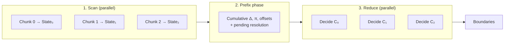

# Δ-Stack Monoid Algorithm

## Table of Contents

- [Overview](#overview)
- [Why Monoids?](#why-monoids)
- [Design Principle: Deferred Judgment](#design-principle-deferred-judgment)
  - [The Judgment Window k](#the-judgment-window-k)
  - [The Judgment Function](#the-judgment-function)
- [Core Data Structure](#core-data-structure)
  - [1. Boundaries (B)](#1-boundaries-b)
  - [2. Pending Candidates (P)](#2-pending-candidates-p)
  - [3. Pending Enclosures (E)](#3-pending-enclosures-e)
  - [4. Delta Stack (Δ)](#4-delta-stack-δ)
  - [5. Parity (π)](#5-parity-π)
  - [6. Context Buffers (H, T)](#6-context-buffers-h-t)
- [Monoid Operations](#monoid-operations)
  - [The Pending Invariant](#the-pending-invariant)
  - [Window Availability](#window-availability)
- [Example: Parallel Boundary Detection](#example-parallel-boundary-detection)
- [Three-Phase Processing](#three-phase-processing)
- [Boundary Decision Semantics](#boundary-decision-semantics)
- [Complex Case Handling](#complex-case-handling)
  - [Nested Quotations](#nested-quotations)
  - [Cross-Chunk Abbreviations](#cross-chunk-abbreviations)
  - [Suppression at Chunk Edges](#suppression-at-chunk-edges)
  - [Symmetric Enclosures (Same Open/Close Character)](#symmetric-enclosures-same-openclose-character)
  - [Unbalanced Enclosures](#unbalanced-enclosures)
- [Scanner Implementation Notes](#scanner-implementation-notes)
- [Performance](#performance)
- [Correctness](#correctness)
- [Summary](#summary)

## Overview

The Δ-Stack Monoid algorithm enables parallel sentence boundary detection (SBD) by formulating it as an associative monoid operation. Text is split into chunks, each chunk is scanned independently on its own core, and the per-chunk states are combined into the final result. Associativity guarantees that the combined result is identical to processing the whole text sequentially — the property this document refers to as **sequential equivalence**.

## Why Monoids?

A monoid's associativity property `(a ⊕ b) ⊕ c = a ⊕ (b ⊕ c)` means we can:

1. Split text into chunks at arbitrary positions (snapped to UTF-8 boundaries)
2. Process chunks independently on different cores
3. Combine results in any order
4. Get identical results to sequential processing

This mathematical guarantee enables true parallelism without compromising correctness.

Two aspects of SBD resist a naive monoid formulation. First, nested enclosures (parentheses, quotes) form a Dyck language, which is beyond regular languages, so finite-state parallelization techniques do not apply directly; the algorithm handles depth algebraically with the net-depth reduction described below. Second, linguistic rules (abbreviations, ellipses, sentence starters, enclosure suppression) consume context *around* a character, and a chunk edge can cut that context in half; the algorithm handles this with deferred judgment, described next.

## Design Principle: Deferred Judgment

> **The scanner never decides.** Whether a terminator ends a sentence is a pure function of a fixed-size text window around it. Candidates whose window lies fully inside their chunk are judged during the scan; candidates within `k` characters of a chunk edge are carried in the state as *pending* and judged during `combine`, when the neighboring chunk supplies the missing context.

Because judgment is a pure function of the window — and the window's content is a substring of the original text, independent of how the text was chunked — every candidate receives the same verdict regardless of chunk size, chunk count, or combine order. A single-chunk run and a parallel run execute the same judgment code on the same inputs; the only difference is *when* each judgment fires.

### The Judgment Window k

`k` is the number of characters (not bytes) that suffices to decide any candidate, derived from the language configuration as the maximum context reach over all rule families:

```
k ≥ max( longest abbreviation + 1,
         longest sentence starter + 2,
         ellipsis exception window,
         standard context window,
         line-start decision threshold + 1,
         suppression pattern reach )
```

The bundled configurations use `k = 32`. The constant is validated, not assumed: loading a language configuration computes that configuration's required window and rejects it if the requirement exceeds `k`, so a configuration change that would silently break sequential equivalence fails loudly at load time.

### The Judgment Function

```rust
/// Pure. `window` covers the candidate's ±k characters (clipped at
/// text start/end); `pos` is the terminator's byte offset inside it.
fn judge(window: &str, pos: usize, kind: TerminatorKind, rules: &CompiledRules) -> Judgment;

enum Judgment { Boundary(BoundaryFlags), NotBoundary }
```

All boundary sub-rules — decimal points, ellipsis patterns and their context rules and regex exceptions, abbreviation lookup, sentence starters, line-start checks — are formulated as window-relative checks inside this one function. The window is passed by reference (`&str`); judgment allocates nothing.

Enclosure suppression — deciding that a character like `'` is a contraction or possessive rather than a quote — is the same kind of decision and gets the same treatment:

```rust
/// Pure. Only invoked for characters the language marks as suppressible.
fn suppress_enclosure(window: &str, pos: usize, ch: char, rules: &CompiledRules) -> bool;
```

## Core Data Structure

The algorithm represents the parsing state of a text span as `State = ⟨B, P, E, Δ, π, H, T⟩` together with the span's byte length `n`.

### 1. Boundaries (B)

Linguistically confirmed candidates. Each records the byte offset just after its terminator, the enclosure depths and parity at that position *relative to the state's own start*, and classification flags:

```
B = { (offset, depths, parity, flags) }
```

Only the structural check — is this position inside an enclosure? — remains for the reduce phase, because it needs the global depth, which is unknown until the prefix phase. Recorded depths exclude the effects of unresolved pending enclosures; those are applied when the enclosure resolves (see [Pending Enclosures](#3-pending-enclosures-e)).

### 2. Pending Candidates (P)

Candidates within `k` characters of the state's start or end, carried unjudged. A pending candidate stores the same fields as a confirmed one plus the terminator kind needed to re-invoke `judge` later. Pending candidates are the mechanism that makes linguistic rules — abbreviations split across chunks, sentence starters just past a chunk edge — compatible with associativity.

### 3. Pending Enclosures (E)

Suppressible enclosure characters within `k` characters of the state's start or end, carried undecided. Suppression is a decision about *depth tracking itself* — a misclassified `'` at a chunk edge would corrupt the parity of the whole span — so an undecidable occurrence is excluded from `Δ`/`π` (and from the depths recorded by every candidate) until its window is available. Resolving it as a real enclosure retroactively applies its depth or parity toggle to the state totals and to every candidate positioned after it; resolving it as suppressed simply drops it. The retroactive update is cheap: by the pending invariant, the affected candidates on the same side of the toggle are themselves pending (a handful at most), and candidates on the other side of a combine receive the toggle as part of their ordinary rebasing.

### 4. Delta Stack (Δ)

Tracks depth changes of *asymmetric* enclosure types (distinct open and close characters) without storing full state:

```
Δ = [ net | for each asymmetric enclosure type ]
```

`net` is the net depth change (opens − closes) over the span, and vectors of nets combine by plain addition. This is a simplification of the classical `(net, min)` parallel bracket reduction: because the boundary predicate clamps depth at zero (see [Boundary Decision Semantics](#boundary-decision-semantics)), only the cumulative net at each candidate matters and the running minimum is never consulted.

### 5. Parity (π)

Symmetric enclosure types (the same character opens and closes, e.g. straight quotes `"`) cannot be classified as opening or closing from chunk-local information — a chunk that starts inside a quotation sees its first `"` as an opener when it is actually a closer. Under the depth ≤ 1 semantics for symmetric quotes (see [below](#symmetric-enclosures-same-openclose-character)), the only information that matters is the *parity* of the toggle count, which forms the group Z/2Z: each occurrence flips a bit, and "outside the quotation" means an even cumulative count. The state keeps one parity bit per symmetric type in a bitset `π`; combine is XOR, which is trivially associative.

### 6. Context Buffers (H, T)

`H` holds the first `min(2k, n)` characters of the span and `T` the last `min(2k, n)`, as fixed-capacity UTF-8 buffers. They exist so that a pending item's ±k window can be reconstructed at the combine that resolves it — capacity `2k` rather than `k` because a pending item can itself sit up to `k` characters inside the edge, and its window reaches `k` further (see [Window Availability](#window-availability)).

## Monoid Operations

**Identity**: the empty state — no candidates, zero deltas and parity, empty context buffers, `n = 0`.

**Combine (⊕)**: `combine(L, R)` produces the state of `text(L) ++ text(R)`:

1. **Rebase R's candidates** (confirmed and pending): `offset += L.n`, `depths[i] += L.Δ[i]`, `parity ^= L.π`. This preserves the invariant that candidate depths are relative to the state's own start.
2. **Merge deltas**: `Δ[i] = L.Δ[i] + R.Δ[i]` per type (vector addition).
3. **Merge parity**: `π = L.π XOR R.π`.
4. **Resolve pending enclosures**: check every pending enclosure whose ±k window is now fully available against the suppression oracle, on the window reconstructed from `L.T ++ R.H`. Suppressed occurrences are dropped; confirmed ones apply their depth/parity toggle to the combined `Δ`/`π` and to every candidate positioned after them. Enclosures resolve before candidates because a confirmed toggle shifts the depths candidates are recorded with.
5. **Resolve pending candidates**: judge every pending candidate whose ±k window is now fully available, on the window reconstructed from `L.T ++ R.H`; positive verdicts move to `B`, negative ones are dropped, the rest stay pending.
6. **Compose contexts**: `H = first 2k chars of (L.H ++ R.H)`, `T = last 2k chars of (L.T ++ R.T)`. The concatenations are exact because whenever `L` (resp. `R`) is shorter than `2k`, its buffer contains the entire span.
7. `n = L.n + R.n`.

### The Pending Invariant

> A pending item (candidate or enclosure) of a state S is always within `k` characters of S's start (missing left context), of S's end (missing right context), or both.

This holds at scan time by construction (items farther than `k` from both edges are decided immediately) and is preserved by combine: an item that ends up ≥ k characters from both edges of the combined span has, by definition, a fully available window, so steps 4–5 decide it at that combine — it never survives as pending.

### Window Availability

At the combine where a pending item first has ≥ k characters on both sides, its window `[p − k, p + k]` is always contained in `L.T ++ R.H`: a right-missing item of L is within `k` of L's end by the pending invariant, so its backward reach `[p − k, p]` lies within L's last `2k` characters (⊆ `L.T`) and its forward reach needs at most `k` characters of R (⊆ `R.H`); the left-missing case is symmetric. If the neighbor is itself too short to complete the window, the item stays pending, and the invariant plus the `2k` capacity guarantee that the already-seen side still fits inside the combined state's buffers (worst case: within `k` of an edge with a window reaching `k` further — under `2k` total). This is why the buffers hold `2k` characters, not `k`.

## Example: Parallel Boundary Detection

Consider text with nested parentheses (linguistic judgment is orthogonal to this example, so candidates are shown already confirmed; only the depth logic is illustrated):

```
(abc. def). ghi. jkl
```

The string is split into three equal-sized chunks by the runtime:

| Chunk | Raw text | Local Δ (net) | Candidate boundaries (byte offsets*) |
| --- | --- | --- | --- |
| C₀ | `(abc.` | `+1` | `5` (after the dot) |
| C₁ | ` def). ghi` | `−1` | `11` (after the dot) |
| C₂ | `. jkl` | `0` | `17` (after the dot) |

*Offsets are relative to the start of the **combined** three-chunk buffer for easier comparison.

**Step 1: Prefix-sum** computes cumulative deltas:

```
ΣΔ_before = [0, +1, 0]  // Before chunks C₀, C₁, C₂
```

**Step 2: Each chunk decides independently**:

| Chunk | Depth at candidate = `ΣΔ_before` + local depth | Decision |
| --- | --- | --- |
| C₀ | `0 + (+1) = 1 (>0)` | Suppress (inside parentheses) |
| C₁ | `+1 + (−1) = 0` | **Accept** (at depth 0) |
| C₂ | `0 + 0 = 0` | **Accept** (at depth 0) |

Key insight: each chunk needs only two values — its local depth record and the prefix sum — to make O(1) boundary decisions. This makes the reduce phase embarrassingly parallel.

## Three-Phase Processing


```mermaid
flowchart LR
    subgraph Map["1. Scan (parallel)"]
        C0["Chunk 0 → State₀"]
        C1["Chunk 1 → State₁"]
        C2["Chunk 2 → State₂"]
    end

    subgraph Prefix["2. Prefix phase"]
        PS["Cumulative Δ, π, offsets<br/>+ pending resolution"]
    end

    subgraph Reduce["3. Reduce (parallel)"]
        R0["Decide C₀"]
        R1["Decide C₁"]
        R2["Decide C₂"]
    end

    Map --> Prefix --> Reduce --> Result["Boundaries"]
```

1. **Scan**: chunks are scanned independently; each yields a `State` with confirmed candidates, pending candidates, pending enclosures, deltas, parity, and context buffers.
2. **Prefix**: cumulative deltas, parity, and byte offsets at each chunk start are computed, and pending items are resolved from neighboring context. The number of chunks `P` is small (text size / chunk size), so a simple sequential O(P) scan is used; a tree-shaped O(log P) reduction is equally valid by associativity if `P` ever warrants it.
3. **Reduce**: each chunk filters its candidates against the global depth and parity at its start — embarrassingly parallel.

**Edge resolution**: after the final combine, items still pending are decided once with the knowledge that no more text is coming — missing left context resolves against the start of text, missing right context against the end of text (the window is clipped instead of completed). Enclosures resolve before candidates, as in combine. This step sits outside the monoid, mirroring the fact that "the text has ended" is not a property of any span.

## Boundary Decision Semantics

A candidate becomes a sentence boundary in the reduce phase iff it is outside every enclosure:

- **Asymmetric type i**: `cumulative_net[i] + local_depth[i] ≤ 0`. The comparison clamps at zero rather than requiring exact equality: a closing delimiter without a matching opener (a bare list marker like `1)`, an editorial artifact) drives the depth negative, and treating negative depth as "inside an enclosure" would suppress every boundary in the rest of the document. Unmatched closers therefore never mask sentence boundaries.
- **Symmetric type b**: `(cumulative_parity XOR local_parity)` bit `b` is 0 (an even number of toggles precedes the candidate).

Boundary offsets are the position *after* the terminator, and each chunk owns the offsets in `(start, end]` — a boundary at exactly the end of the text belongs to the last chunk.

## Complex Case Handling

### Nested Quotations

Japanese example: 「彼は『こんにちは』と言った」

Each enclosure type gets its own depth slot, boundaries require every slot to be outside, and the delta representation preserves nesting across chunks — a chunk that opens 『 and a later chunk that closes it reconcile through the `(net, min)` merge without either chunk seeing the other's text.

### Cross-Chunk Abbreviations

Example: "U.S. involvement" split across chunks as `...U.` | `S. involvement...`

The dot after `U` sits within `k` characters of its chunk's end, so it is recorded as pending rather than judged with truncated context. When the two states combine, the window reconstructed from `L.T ++ R.H` contains `U.S. involvement`, and `judge` sees the full abbreviation exactly as a sequential scan would. The same mechanism covers every context-cut judgment — sentence starters just past the edge, ellipses straddling the cut — with no per-pattern protocol.

### Suppression at Chunk Edges

Example: "don't" split across chunks as `...don'` | `t...`

The `'` is simultaneously a symmetric enclosure character and, between letters, a contraction that must *not* toggle quotation parity. At a chunk edge the deciding neighbor is in the other chunk, and guessing wrong would corrupt the parity of the entire span — every boundary after it would flip between suppressed and accepted. The scanner therefore records the occurrence as a pending enclosure with its effect excluded; the combine that supplies the neighbor runs the suppression oracle on the reconstructed window and, only if it is a real quote, applies the parity toggle retroactively (see [Pending Enclosures](#3-pending-enclosures-e)). Interior occurrences are decided inline on a borrowed window — the same oracle, the same window content, the same verdict.

### Symmetric Enclosures (Same Open/Close Character)

For enclosures where the opening and closing characters are identical (e.g. `"` and `'`), open vs. close is not decidable locally; the algorithm tracks the **toggle parity** per type (Z/2Z, see [Parity](#4-parity-π)) and defines "outside" as even cumulative parity.

**Key properties:**

- **Chunk-safe**: parity composes by XOR, so a chunk starting inside a quotation is handled correctly — no local open/close guess is ever made.
- **Depth limitation**: rule-based processing is limited to depth 1 for symmetric enclosures. Distinguishing nested same-character quotes from consecutive quotations requires contextual understanding beyond rule-based systems; for such text, ML-based approaches are recommended.
- **Example**: `"He said "Hello." She agreed."` → parity 0→1 at the first quote, 1→0 at the second, so `Hello.` is inside and `She agreed.` outside.

### Unbalanced Enclosures

Real-world text contains unmatched delimiters — list markers (`1)`, `a)`), emoticons, editorial fragments. Two mechanisms keep them from corrupting segmentation: suppression rules exclude recognizable non-enclosure uses from depth tracking, and the clamped reduce predicate (`≤ 0`, above) contains the damage of anything that slips through to the closing side.

## Scanner Implementation Notes

The scan phase does constant work per character with no per-character allocation:

- **Character classification** (terminator / opener / closer / symmetric / alphabetic / dot) via a 128-entry ASCII table built from the language configuration, with a small map fallback for non-ASCII.
- **A ring buffer of the last k characters**, which also answers line-start queries: line-start rules only compare the distance to the last newline against a small threshold (< k), so a newline within the buffer decides the query and its absence means "not a line start".
- **Abbreviation matching as a reverse-trie state machine**: the automaton advances on alphabetic and dot characters and resets otherwise, so when a `.` is reached, "does an abbreviation end here?" is already answered — no backward scan per dot.
- **Terminator hit** → window classification: if the candidate is ≥ k characters from both chunk edges, `judge` runs inline on a borrowed window (zero copy); otherwise the candidate is pushed to pending.
- **Suppressible enclosure hit** → the same classification: interior occurrences run the suppression oracle inline and count (or not) immediately; occurrences within `k` of an edge become pending enclosures. Enclosure characters without suppression rules never go pending — they count unconditionally.

Depth/parity updates and candidate collection are the only other per-character work, which is what the algorithm's high sequential throughput rests on.

## Performance

| Metric | Sequential | Parallel |
|--------|------------|----------|
| Time | O(N) | O(N/P + P) |
| Space | O(k) | O(P · (k + candidates per chunk)) |
| Speedup | 1× | near-linear up to P cores |

The O(P) term is the sequential prefix scan over per-chunk states; it is negligible against O(N/P) for any realistic chunk size. Determinism is inherent: no model, no randomness, no execution-order dependence — the same input yields the same output on any thread count.

## Correctness

Sequential equivalence follows from proving that ⊕ is associative and that the driver applies it to a partition of the input; then any parenthesization — including the fully left-leaning one, which *is* the sequential run — yields the same state.

- **Deltas**: vector addition of nets is associative.
- **Parity**: XOR is associative.
- **Offsets and rebasing**: composition of shifts (offsets, depth rebase, parity rebase) is associative.
- **Context buffers**: "concatenate, then keep the first/last 2k characters" is associative, because truncation on the kept side commutes with further concatenation on the other side.
- **Pending resolution**: both oracles (`judge`, `suppress_enclosure`) are pure functions of the original text's substring `[p − k, p + k]`, which does not depend on chunking. For any combine order, a pending item is decided at the first combine whose span covers its window (or at edge resolution), and the [Window Availability](#window-availability) argument shows the reconstructed window equals that substring there. Hence every order produces the same verdict for every item; each confirmed enclosure toggle is applied exactly once to each candidate positioned after it (candidates exclude unresolved toggles by construction), and the final boundary sets coincide.

The identity laws are immediate (combining with the empty state changes nothing). The associativity of combine is additionally checked by property-based tests that compare arbitrary parenthesizations, and sequential equivalence end-to-end by chunk-invariance property tests that compare single-chunk output against arbitrary chunk sizes and thread counts.

## Summary

The Δ-Stack Monoid algorithm turns sentence boundary detection — traditionally a sequential scan whose rules read context across any cut point — into an associative combine over per-chunk states. Depth of asymmetric enclosures reduces to net counts, symmetric quotes reduce to Z/2 parity, and context-dependent decisions — boundary judgment and enclosure suppression alike — become chunk-independent through a bounded window `k` and pending items resolved at combine time. The result is near-linear multicore scaling with bit-exact sequential equivalence.

For implementation details, see the [Architecture Guide](ARCHITECTURE.md) and the source code in `sakurs-core/src/domain/`.
